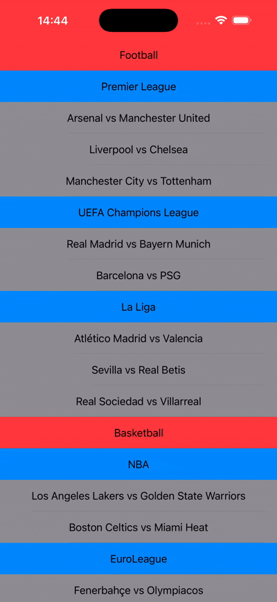
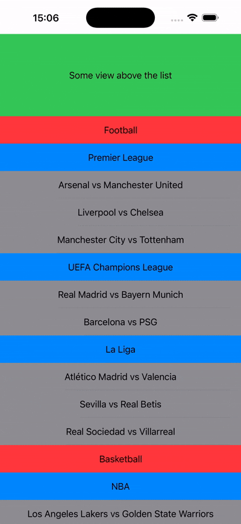

[](https://www.nsoft.com/)

A simple library written in Swift.

### There are available two views:
- [SRDoubleHeaderList](https://github.com/edinsalimovic/SRDoubleStickyHeaderList/blob/main/Sources/SRDoubleStickyHeaderList/SRDoubleHeaderList.swift)
- [SRDoubleHeaderView](https://github.com/edinsalimovic/SRDoubleStickyHeaderList/blob/main/Sources/SRDoubleStickyHeaderList/SRDoubleStickyHeaderView.swift)

# SRDoubleHeaderList



### Example

```swift
import SwiftUI
import SRDoubleStickyHeaderList

struct ContentView: View {
    
    var body: some View {
        SRDoubleHeaderList(
            headers: headers,
            stickyHeader: stickyHeader,
            headerView: headerView,
            subHeaderView: subHeaderView,
            rowView: rowView,
            onChangeScrollOffset: onChangeScrollOffset)
    }
    
    private var headers: [any SRHeaderViewModel] {
        [Sport(uniqueId: "sport_football", name: "Football",
               subHeaders: [
                Tournament(
                    uniqueId: "tournament_premierleague",
                    name: "Premier League",
                    rows: [
                        Event(uniqueId: "event_arsenal_manutd", name: "Arsenal vs Manchester United"),
                        Event(uniqueId: "event_liverpool_chelsea", name: "Liverpool vs Chelsea"),
                        Event(uniqueId: "event_city_spurs", name: "Manchester City vs Tottenham")
                    ]
                ),
                Tournament(
                    uniqueId: "tournament_championsleague",
                    name: "UEFA Champions League",
                    rows: [
                        Event(uniqueId: "event_real_bayern", name: "Real Madrid vs Bayern Munich"),
                        Event(uniqueId: "event_barca_psg", name: "Barcelona vs PSG")
                    ]
                ),
                Tournament(
                    uniqueId: "tournament_la_liga",
                    name: "La Liga",
                    rows: [
                        Event(uniqueId: "event_atletico_valencia", name: "Atlético Madrid vs Valencia"),
                        Event(uniqueId: "event_sevilla_betis", name: "Sevilla vs Real Betis"),
                        Event(uniqueId: "event_real_sociedad_villarreal", name: "Real Sociedad vs Villarreal")
                    ])]),
         Sport(uniqueId: "sport_basketball", name: "Basketball",
               subHeaders: [
                Tournament(
                    uniqueId: "tournament_nba",
                    name: "NBA",
                    rows: [
                        Event(uniqueId: "event_lakers_warriors", name: "Los Angeles Lakers vs Golden State Warriors"),
                        Event(uniqueId: "event_celtics_heat", name: "Boston Celtics vs Miami Heat")
                    ]
                ),
                Tournament(
                    uniqueId: "tournament_euroleague",
                    name: "EuroLeague",
                    rows: [
                        Event(uniqueId: "event_fenerbahce_olympiacos", name: "Fenerbahçe vs Olympiacos"),
                        Event(uniqueId: "event_barca_maccabi", name: "Barcelona vs Maccabi Tel Aviv"),
                        Event(uniqueId: "event_milan_real", name: "Olimpia Milano vs Real Madrid")
                    ])]),
         Sport(uniqueId: "sport_tennis", name: "Tennis",
               subHeaders: [
                Tournament(
                    uniqueId: "tournament_wimbledon",
                    name: "Wimbledon",
                    rows: [
                        Event(uniqueId: "event_djokovic_alcaraz", name: "Novak Djokovic vs Carlos Alcaraz"),
                        Event(uniqueId: "event_sinner_medvedev", name: "Jannik Sinner vs Daniil Medvedev")
                    ]
                ),
                Tournament(
                    uniqueId: "tournament_usopen",
                    name: "US Open",
                    rows: [
                        Event(uniqueId: "event_swiatek_gaff", name: "Iga Świątek vs Coco Gauff"),
                        Event(uniqueId: "event_sabalenka_rybakina", name: "Aryna Sabalenka vs Elena Rybakina"),
                        Event(uniqueId: "event_zverev_tiafoe", name: "Alexander Zverev vs Frances Tiafoe")
                    ]
                ),
                Tournament(
                    uniqueId: "tournament_australian",
                    name: "Australian Open",
                    rows: [
                        Event(uniqueId: "event_fritz_rune", name: "Taylor Fritz vs Holger Rune"),
                        Event(uniqueId: "event_osaka_badosa", name: "Naomi Osaka vs Paula Badosa")
                    ])])
        ]
    }
    
    private func stickyHeader(header: any SRHeaderViewModel, subHeader: any SRSubHeaderViewModel) -> some View {
        VStack(spacing: 0) {
            headerView(header: header)
            subHeaderView(subHeader: subHeader)
        }
    }
    
    @ViewBuilder
    private func headerView(header: any SRHeaderViewModel) -> some View {
        if let sport = header as? Sport {
            Text(sport.name)
                .frame(maxWidth: .infinity, alignment: .center)
                .frame(height: 50)
                .background(.red)
        }
    }
    
    @ViewBuilder
    private func subHeaderView(subHeader: any SRSubHeaderViewModel) -> some View {
        if let tournament = subHeader as? Tournament {
            Text(tournament.name)
                .frame(maxWidth: .infinity, alignment: .center)
                .frame(height: 50)
                .background(.blue)
        }
    }
    
    @ViewBuilder
    private func rowView(row: any SRRowViewModel) -> some View {
        if let event = row as? Event {
            Text(event.name)
                .frame(maxWidth: .infinity, alignment: .center)
                .frame(height: 50)
                .background(.gray)
        }
    }
    
    private func onChangeScrollOffset(_ scrollOffset: CGFloat) {
        print("Scroll offset: \(scrollOffset)")
    }
}

struct Sport: SRHeaderViewModel {
    let uniqueId: String
    let name: String
    let subHeaders: [any SRDoubleStickyHeaderList.SRSubHeaderViewModel]
}

struct Tournament: SRSubHeaderViewModel {
    let uniqueId: String
    let name: String
    let rows: [any SRDoubleStickyHeaderList.SRRowViewModel]
}

struct Event: SRRowViewModel {
    let uniqueId: String
    let name: String
}

```

<br>

# SRDoubleHeaderView

If you have a view stacked above the list and you want to animate it as if it were being pushed.



### Example

```swift
struct ContentView: View {
    
    var body: some View {
        SRDoubleHeaderView(
            aboveView: viewAboveList,
            headers: headers,
            stickyHeader: stickyHeader,
            headerView: headerView,
            subHeaderView: subHeaderView,
            rowView: rowView)
    }
    
    private var headers: [any SRHeaderViewModel] {
        [Sport(uniqueId: "sport_football", name: "Football",
               subHeaders: [
                Tournament(
                    uniqueId: "tournament_premierleague",
                    name: "Premier League",
                    rows: [
                        Event(uniqueId: "event_arsenal_manutd", name: "Arsenal vs Manchester United"),
                        Event(uniqueId: "event_liverpool_chelsea", name: "Liverpool vs Chelsea"),
                        Event(uniqueId: "event_city_spurs", name: "Manchester City vs Tottenham")
                    ]
                ),
                Tournament(
                    uniqueId: "tournament_championsleague",
                    name: "UEFA Champions League",
                    rows: [
                        Event(uniqueId: "event_real_bayern", name: "Real Madrid vs Bayern Munich"),
                        Event(uniqueId: "event_barca_psg", name: "Barcelona vs PSG")
                    ]
                ),
                Tournament(
                    uniqueId: "tournament_la_liga",
                    name: "La Liga",
                    rows: [
                        Event(uniqueId: "event_atletico_valencia", name: "Atlético Madrid vs Valencia"),
                        Event(uniqueId: "event_sevilla_betis", name: "Sevilla vs Real Betis"),
                        Event(uniqueId: "event_real_sociedad_villarreal", name: "Real Sociedad vs Villarreal")
                    ])]),
         Sport(uniqueId: "sport_basketball", name: "Basketball",
               subHeaders: [
                Tournament(
                    uniqueId: "tournament_nba",
                    name: "NBA",
                    rows: [
                        Event(uniqueId: "event_lakers_warriors", name: "Los Angeles Lakers vs Golden State Warriors"),
                        Event(uniqueId: "event_celtics_heat", name: "Boston Celtics vs Miami Heat")
                    ]
                ),
                Tournament(
                    uniqueId: "tournament_euroleague",
                    name: "EuroLeague",
                    rows: [
                        Event(uniqueId: "event_fenerbahce_olympiacos", name: "Fenerbahçe vs Olympiacos"),
                        Event(uniqueId: "event_barca_maccabi", name: "Barcelona vs Maccabi Tel Aviv"),
                        Event(uniqueId: "event_milan_real", name: "Olimpia Milano vs Real Madrid")
                    ])]),
         Sport(uniqueId: "sport_tennis", name: "Tennis",
               subHeaders: [
                Tournament(
                    uniqueId: "tournament_wimbledon",
                    name: "Wimbledon",
                    rows: [
                        Event(uniqueId: "event_djokovic_alcaraz", name: "Novak Djokovic vs Carlos Alcaraz"),
                        Event(uniqueId: "event_sinner_medvedev", name: "Jannik Sinner vs Daniil Medvedev")
                    ]
                ),
                Tournament(
                    uniqueId: "tournament_usopen",
                    name: "US Open",
                    rows: [
                        Event(uniqueId: "event_swiatek_gaff", name: "Iga Świątek vs Coco Gauff"),
                        Event(uniqueId: "event_sabalenka_rybakina", name: "Aryna Sabalenka vs Elena Rybakina"),
                        Event(uniqueId: "event_zverev_tiafoe", name: "Alexander Zverev vs Frances Tiafoe")
                    ]
                ),
                Tournament(
                    uniqueId: "tournament_australian",
                    name: "Australian Open",
                    rows: [
                        Event(uniqueId: "event_fritz_rune", name: "Taylor Fritz vs Holger Rune"),
                        Event(uniqueId: "event_osaka_badosa", name: "Naomi Osaka vs Paula Badosa")
                    ])])
        ]
    }
    
    private var viewAboveList: some View {
        VStack {
            Text("Some view above the list")
        }
        .frame(maxWidth: .infinity, alignment: .center)
        .frame(height: 150)
        .background(.green)
    }
    
    private func stickyHeader(header: any SRHeaderViewModel, subHeader: any SRSubHeaderViewModel) -> some View {
        VStack(spacing: 0) {
            headerView(header: header)
            subHeaderView(subHeader: subHeader)
        }
    }
    
    @ViewBuilder
    private func headerView(header: any SRHeaderViewModel) -> some View {
        if let sport = header as? Sport {
            Text(sport.name)
                .frame(maxWidth: .infinity, alignment: .center)
                .frame(height: 50)
                .background(.red)
        }
    }
    
    @ViewBuilder
    private func subHeaderView(subHeader: any SRSubHeaderViewModel) -> some View {
        if let tournament = subHeader as? Tournament {
            Text(tournament.name)
                .frame(maxWidth: .infinity, alignment: .center)
                .frame(height: 50)
                .background(.blue)
        }
    }
    
    @ViewBuilder
    private func rowView(row: any SRRowViewModel) -> some View {
        if let event = row as? Event {
            Text(event.name)
                .frame(maxWidth: .infinity, alignment: .center)
                .frame(height: 50)
                .background(.gray)
        }
    }
    
    private func onChangeScrollOffset(_ scrollOffset: CGFloat) {
        print("Scroll offset: \(scrollOffset)")
    }
}

struct Sport: SRHeaderViewModel {
    let uniqueId: String
    let name: String
    let subHeaders: [any SRDoubleStickyHeaderList.SRSubHeaderViewModel]
}

struct Tournament: SRSubHeaderViewModel {
    let uniqueId: String
    let name: String
    let rows: [any SRDoubleStickyHeaderList.SRRowViewModel]
}

struct Event: SRRowViewModel {
    let uniqueId: String
    let name: String
}
```


<br>

## Installation

**Swift Package Manager**\
File > Add Package Dependencies...\
Add https://github.com/edinsalimovic/SRDoubleStickyHeaderList

<br>

## Requirements

- iOS 18.0+

<br>

## License

SRDoubleStickyHeaderList is released under the MIT license. [See LICENSE](https://github.com/edinsalimovic/SRDoubleStickyHeaderList/blob/main/LICENSE) for details.
